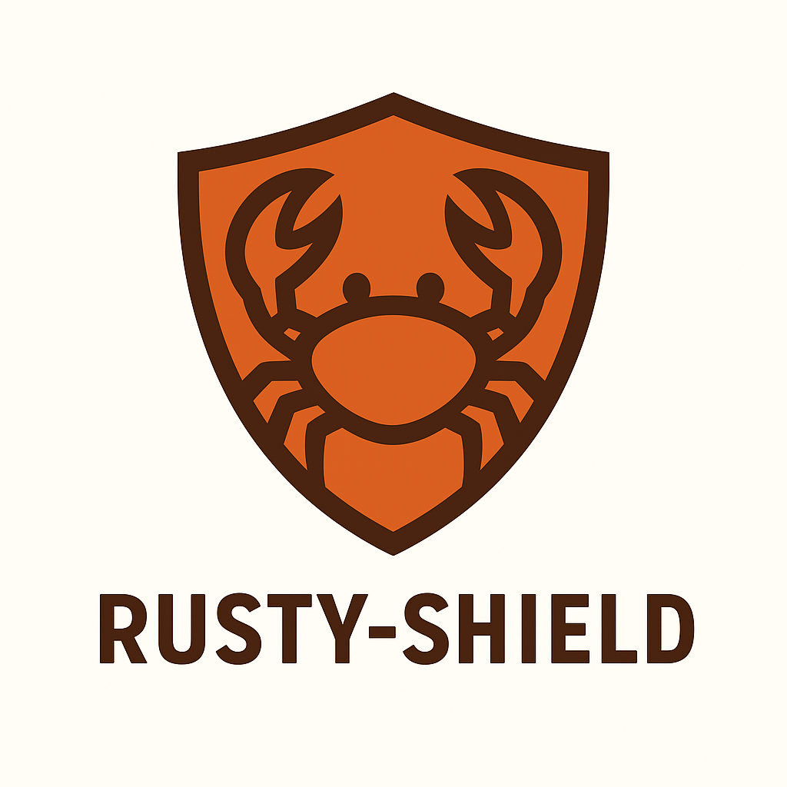

<h1 align="center" style="font-size: 3em; font-weight: bold; margin: 1em 0;">
  
   
  <strong>Rusty-Shield</strong>
</h1>

  
  

  
<em>Rusty-Shield — это инструментальная библиотека / тулза для backend-разработчиков.</em>

  
  

    🔹 <strong>Мониторинг и логирование:</strong> собирает логи и события приложений в реальном времени.  
    🔹 <strong>Анализ угроз с AI:</strong> выявляет аномалии и подозрительные действия.  
    🔹 <strong>Визуализация статистики:</strong> отдельный веб-дэшборд для аналитики и контроля.
  

  
  

    Rusty-Shield можно использовать как локальную SIEM-систему: она не только отслеживает атаки, 
    но и даёт рекомендации по реагированию, помогая поддерживать безопасность ваших приложений на высоком уровне.
  

